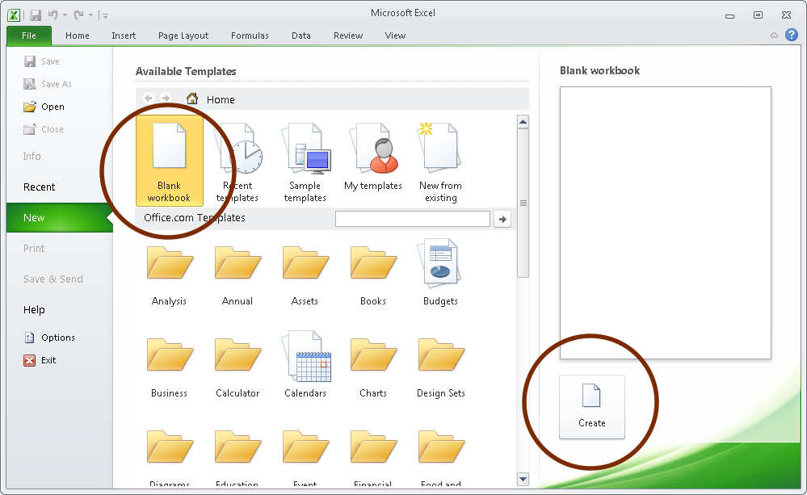
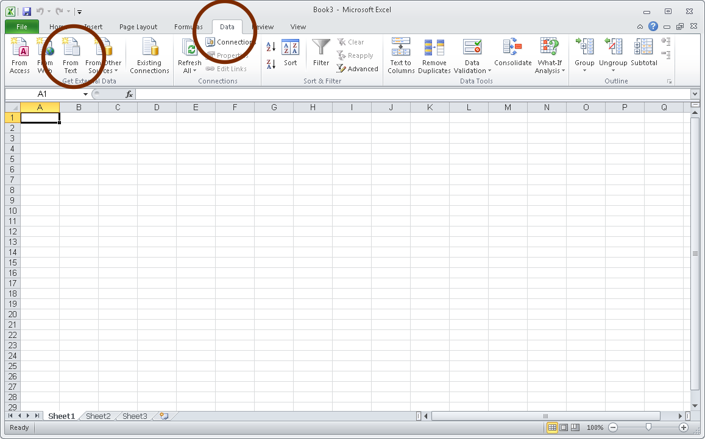
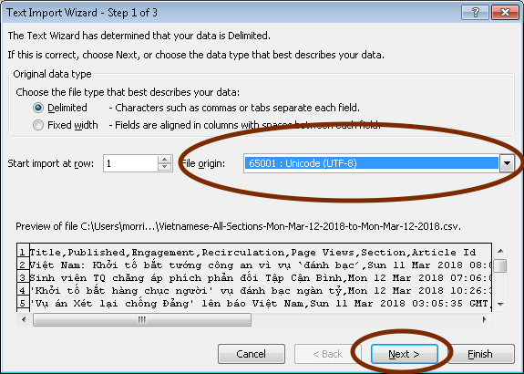
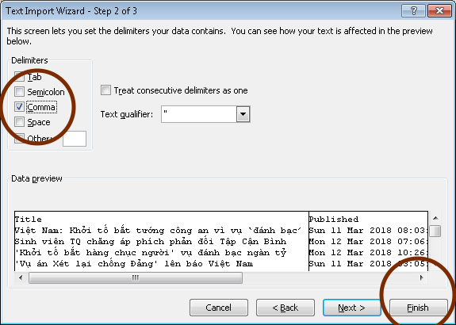
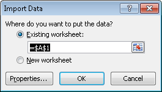

## Overview
Here’s a list of frequently asked questions. If you have any that aren’t included, please email telescope@bbc.co.uk. 
 
## The numbers in Telescope don't match another tool I use. Why?
Almost all analytics packages, including Telescope and Chartbeat, are based on varying methodologies and data sources. There will always be differences in the ways that data is collected, processed, labelled and reported between these sources.

For example, many analytics packages (including  ComScore and Google Analytics) use sampling in order to process large volumes of data quickly, so that they can provide reporting almost immediately, which is appropriate for a news environment. This means that rather than measuring every single page view, they may take 1 in 128 and then multiply the figures in the final reports by 128. 

This also means that the data you see in reports can be approximated, and therefore multiple data sources will be unlikely to match exactly. However the sampling rates are set in a way that means that they are still acceptable for measuring and acting upon clear themes and patterns in the data.

Generally we would deem a variance of less than 10% between two sources as acceptable, so please do contact us if you have concerns about a bigger discrepancy.

We recommend that you use Telescope, as most of the time we provide unsampled data which will be the most accurate and robust measure. However, during periods of exceptionally high traffic such as a big breaking news story, we may fall back on our sampled data stream in order to ensure that you are receiving timely reports.

Lastly, Telescope data includes both the BBC News website and mobile apps whereas Chartbeat is only the website. This means that Telescope figures will generally be much higher and its traffic sources will skew towards internal traffic when expressed as a percentage. 

## When does Telescope use sampled data?
We switch on sampled data if we're experiencing delays in regular, full data coming through to Telescope. The reason is so that you can still see the most accurate stats as quickly as possible while we try to restore full data. This does mean, however, that stories that would have lower page views would be crudely measured. If you're concerned this is the case for your story, please email us at telescope@bbc.co.uk and we'll look into the figures for you. 

## Why is ‘direct’ appearing in the entry type on older stories?
We recently changed the way we categorise ‘direct’ traffic (i.e. traffic from emails and messaging apps that we can’t track) to make it clearer for users, but this will only show on stories published from January 2018 onwards. For older stories, ‘direct’ refers to traffic from the BBC News app and from links sent in emails/messaging. If you’re looking at an older story and want more accurate data for where your traffic came from, just email telescope@bbc.co.uk and we can pull that data for you.

## Why am I being prompted to update Google Chrome?
Telescope does not work in old versions of Chrome, as they can have major security flaws due to their age. You can order the latest version of Chrome for free via **[BBC Essentials.](https://som-myit.onbmc.com/ux/myitapp/#/catalog/home)**

## How do I get the Telescope Chrome plugin?
You can **[go here](https://chrome.google.com/webstore/detail/bbc-telescope/adpeohpalnmefpfhlpadbfdgjnkaapje).** If you click on it while you have a story open, and it’ll take you to the Telescope page for that story directly. Once you download the plugin it will appear on the right hand side of your browser bar:
 

## When I download the list view report for my service as a CSV the language formatting is broken. What should I do?
You can follow these stepson a Windows machine:

1. Open Excel and select a to Create a new workbook:

2. Select 'data' and then 'from text':

3. Select the file you have downloaded from Telescope:

4. Change the file origin to Unicode UTF-8 and then hit 'Next':

5. Select 'Comma' as the delimiter and click 'Finish':

6. Click 'OK':

   

7. Your file should now appear correctly:

## What about privacy?
Telescope adheres to the **[BBC’s policy of fair processing of staff data](https://intranet.gateway.bbc.co.uk/policy/Pages/Staff-Fair-Processing-Notice.aspx).** It collects two types of BBC staff data:
* Author data (i.e. who has written, edited or modified a story in CPS). This is in order for journalists to filter Telescope by which stories they have worked on, which is a feature we hope to integrate into Telescope in the future. In compliance with GDPR, it will only be possible for users to filter the Telescope list view by stories they themselves have worked on —not by their colleagues’ stories.
* Usage of Telescope based on users’ BBC network credentials. This is so that we can more accurately measure Telescope adoption in the newsroom. This data will be encrypted per BBC Information Security guidelines.

## What about accessibility? 
For users reliant on screen readers, Telescope is accessible using the following keyboard shortcuts:

**_On the Telescope list page:_**
* Alt + D will let you show or hide the date selector - and you can tab through the date selector to choose a date or date range
* Alt + R will let you reset all of your chosen filters 
* Alt + S will let you jump to the search bar, where you can search for a story using its CPS ID

**_On a Telescope story page:_**
* Alt + D will let you show or hide the date selector - and you can tab through the date selector to choose a date or date range
* Alt + E will let you hide or show events on the charts
* Alt + T will let you toggle the chart so that you can view it in table format 
* Alt + S will let you jump to the search bar, where you can search for a story using its CPS ID

## How can I find out about new features or testing, or get in touch if something's broken?
Email telescope@bbc.co.uk for more details, and we'll reply as soon as possible. 
