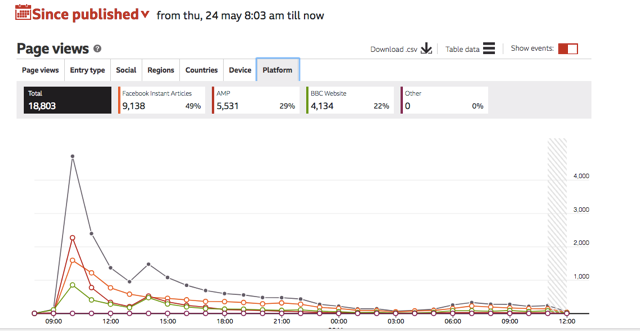

## Overview

This is where we list the new features and improvements we have added to Telescope. If you'd like to know more, please email telescope@bbc.co.uk .

**_May 2018_**

We have released the following new features to Telescope Beta:

**FIA traffic for World Service sites**

World Service sites now have views from Facebook Instant Articles included in their traffic. It is bucketed under 'Social' in Entry Type, and broken out in the 'Platform' tab on the Page Views chart:

**Apple News and BBC News and Sport apps in the Platform tab**

We have renamed 'Mobile App' in the Platform tab on the Page Views chart as the 'BBC News App'. We have also separated out any traffic from the BBC Sport App, and renamed 'Website' 'BBC Website'. This is so users can more easily see how much traffic came to their story via those individual apps and via the website.

Apple News traffic is also now included in the Page Views chart. It's bucketed under 'Other' in Entry Type, and broken out in the 'Platform' tab.

**_January 2018_**

We have released the following new features to Telescope Beta:

**List view metrics**
On the list view, we are now showing engaged time and recirculation alongside page views. We hope that this will enable journalists to identify opportunities for optimisation more efficiently as they won't have to click through to each article's dashboard to see these metrics.

**List/article discrepancies**
A lot of work has happened under the hood to ensure that the list view numbers are much closer to the numbers shown on the article dashboard. We have to update the list view less frequently in order to make it work quickly, which means that the two numbers won't be exactly the same. But the discrepancy should be much smaller than it was before this release.

**Report this page**
We have added a button on the article page that allows journalists to report it to us if they think that the numbers are incorrect.

**Story dashboard events**
We have reinstated CPS events on the main article article view chart with improved reliability. These help our journalists to understand which CPS changes may have instigated a change in the way users are consuming that piece of content.

**Engaged time bug**
We had an issue with calculating and graphing engaged time for stories with a high avgerage engaged time. These issues have been fixed.

**Login**
Telescope Beta will now allow users to log in with their BBC username and password if a BBC certificate is not present on their computer. This means that journalists can use Telescope on their personal devices when working remotely.

**Database performance for heavy traffic**
Another piece of work which is under the hood, but will make Telescope much more reliable and speedy when it comes to large scale breaking news events which generate higher than usual traffic.
